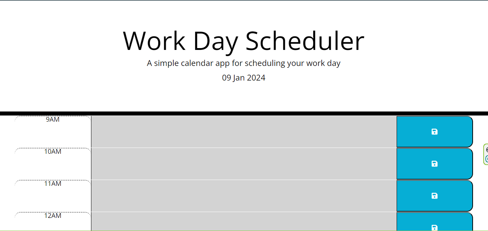
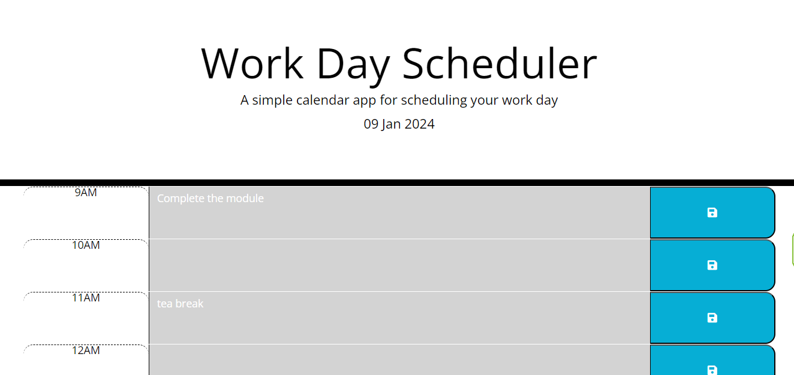

# Work-Day-Scheduler
## Description
 Create calendar application that tracks events for each working hour and persists them to local storage.

View the deployed application here: https://eampofu.github.io/Work-Day-Scheduler/
# Screenshots

## Installation
N/A

## Usage
Enter an event on the calendar for the hour it occurs save it.
## License
MIT. Please see original GitHub repository. 